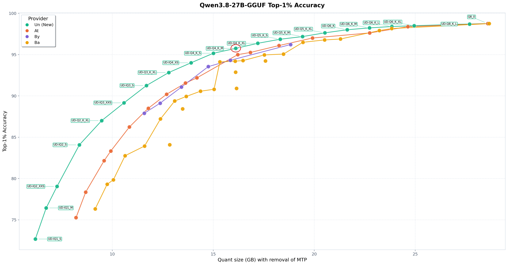

# simply_3090

Running local LLMs on a single GeForce RTX 3090 / 3090 Ti (24 GB) —
one consumer card, stock llama.cpp (no custom engine patches), Docker. Each subfolder is one working setup,
fully documented: what it is, why each flag exists, measured numbers, and
scripts you can actually run on your own box.

## Setups

| Folder | What it runs | Highlights |
|---|---|---|
| [`qwen3.8-27b/`](qwen3.8-27b/) | Qwen3.8-27B (Q4_K_XL) + vision, **262k context**, vision offloaded to CPU, built-in MTP drafter | my go-to local coding setup (pi agent) — full 256k context on 24 GB; energy-optimised 350 W power cap with the measured underclock sweep behind it |

## qwen3.8-27b at a glance

**Speed** — 3090 Ti @ 350 W cap, this exact setup:

| Workload | tok/s |
|---|---|
| Decode, short prompt (MTP drafter n=2, 76% acceptance) | 77.6 |
| Decode, ~20k-token context | 66.0 |
| Prefill, ~20k-token context | 1,185 |



*The circled **UD-Q4_K_XL** is the highest quant that still runs at full 262k
context on 24 GB — the prod-grade pick for daily coding.*


*350 W keeps ~91% of prefill and ~78% of long-context decode speed at ~80% of
the 450 W power.*

Every setup folder is self-contained:

```
<setup>/
├── README.md    # the write-up
├── compose/     # docker compose (annotated with the measured boot record)
└── scripts/     # start / stop / power-limit (run on the GPU box)
```

## The card

| | RTX 3090 | RTX 3090 Ti |
|---|---|---|
| VRAM | 24 GB GDDR6X | 24 GB GDDR6X |
| TGP (default power limit) | 350 W | 450 W |

The scripts in this repo are card-aware: on the Ti they underclock to the
measured 350 W knee; on the plain 3090, 350 W is the card default, so they
detect that and leave the limit alone.
