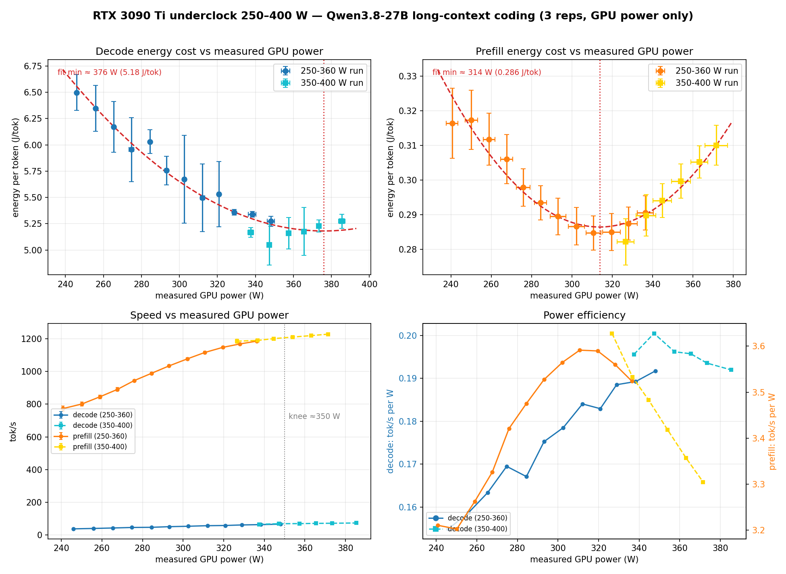
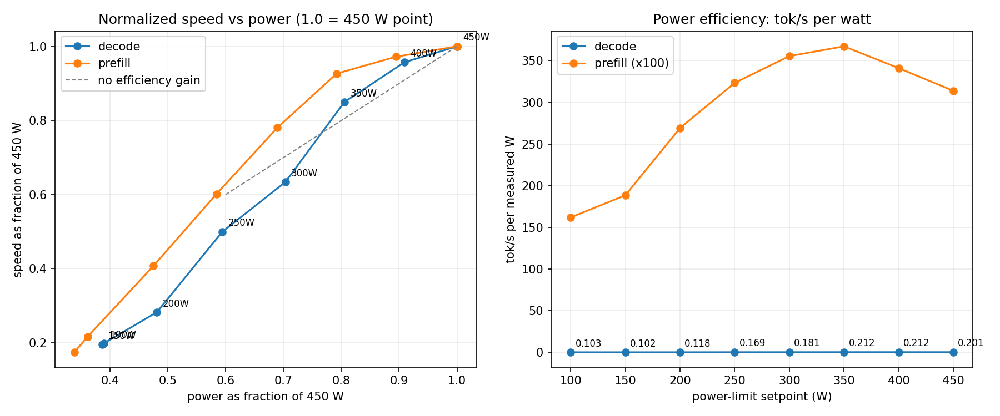

# Qwen3.8-27B on a single 24 GB card (RTX 3090 / 3090 Ti)

Qwen3.8-27B (Unsloth `UD-Q4_K_XL` GGUF) with **full 262,144-token context**,
the **built-in MTP drafter**, and **vision** — running on a single GeForce
RTX 3090 or 3090 Ti (24 GB), llama.cpp in Docker, pinned at an
energy-optimised **350 W** power cap.

The whole thing is resident in ~23.9 GiB of the 24.6 GiB. This folder is the
complete, runnable setup: the compose file, start/stop/power-limit scripts,
and the underclock measurements behind the power cap.

## TL;DR

| | |
|---|---|
| Model | Qwen3.8-27B — `Qwen3.8-27B-UD-Q4_K_XL.gguf` (16.34 GiB) + `mmproj-F16.gguf` |
| Engine | llama.cpp `server-cuda-b11223` (Docker, pinned) |
| Context | 262,144 tokens (full `n_ctx_train`) |
| KV cache | q4_0 keys + q4_0 values (~4.5 GiB) |
| Speculative decode | built-in MTP drafter, n=2 (~76% draft acceptance, short prompts) |
| Vision | mmproj-F16 on **CPU** (`--no-mmproj-offload`) |
| Batching | `-b 2048 -ub 256` — **required to fit** |
| VRAM | ~23.9 GiB resident of 24.6 GiB |
| Power | 350 W cap (the 3090 Ti's default is 450 W; on a 3090, 350 W *is* the card default) |
| Speed (measured, 350 W) | ~1,185 tok/s prefill / ~66 tok/s long-context decode; 77.6 tok/s short-prompt decode |
| API | OpenAI-compatible on port 8091 (health at `/health`, metadata at `/props`) |

## Why it fits (the two-variable fit)

A 27B Q4_K_XL quant + 256k context + vision is ~1 GiB too big by the obvious
recipe. The recipe that actually boots uses **two** changes, and neither one
alone is enough:

1. **Vision projector to CPU** (`--no-mmproj-offload`): moves the 928 MB
   mmproj out of VRAM. This is the trick commonly cited in recipes — and it
   is not enough. With Q4_K_XL at full context it still leaves the config
   **~324 MiB short**: the boot dies in `cudaMalloc` while allocating the MTP
   draft context's compute workspace.
2. **Smaller micro-batch** (`-b 2048 -ub 256` instead of 4096/512): shrinks
   the compute workspace by ~650 MiB. This is the change that closes the
   gap.

Measured boot record (this exact compose, single 3090 Ti):

| Attempt | Config | Result |
|---|---|---|
| 1 | `-b 4096 -ub 512`, mmproj on CPU | ❌ OOM — `allocating 324.02 MiB ... cudaMalloc failed` (failing alloc: MTP draft context workspace; the main context had already allocated) |
| 2 | `-b 2048 -ub 256`, mmproj on CPU | ✅ boots — 23,822 MiB of 24,564, 742 MiB headroom |

The q4_0 KV cache is what makes 262k allocatable at all (q8_0 KV would be
~8.7 GiB and would not fit). The prices: prefill throughput drops with
context depth (the `-ub 256` cost) and KV quality is a disclosed trade — see
[caveats](#caveats).

## Quick start

Requirements: a box with a 24 GB RTX 3090 / 3090 Ti, Docker with the NVIDIA
Container Toolkit, and a few hundred MiB of free VRAM (see the [desktop
gotcha](#ops-notes) if you run a graphical session).

### 1. Get the model

```bash
cd qwen3.8-27b
mkdir -p models
hf download unsloth/Qwen3.8-27B-GGUF Qwen3.8-27B-UD-Q4_K_XL.gguf --local-dir models
hf download unsloth/Qwen3.8-27B-GGUF mmproj-F16.gguf --local-dir models
```

Already have a copy somewhere else? Point the setup at it:
`MODEL_DIR=/path/to/models ./scripts/start.sh`.

### 2. Start

```bash
./scripts/start.sh
```

This sets the 350 W cap (card-aware — see below), preflight-checks VRAM
(including the desktop-session squatter case), runs `docker compose up`, and
waits for `http://localhost:8091/health`. First boot loads a 16 GiB model +
a 4.5 GiB KV pool, so give it a couple of minutes (`TIMEOUT=900` if yours is
slow).

### 3. Talk to it

```bash
curl http://localhost:8091/health
curl http://localhost:8091/props            # ctx, build info
curl http://localhost:8091/v1/chat/completions -H 'content-type: application/json' -d '{
  "model": "qwen3.8-27b-q4kxl",
  "messages": [{"role": "user", "content": "Say hi in exactly three words."}]
}'
```

### 4. Stop

```bash
./scripts/stop.sh                        # compose down + GPU state report
./scripts/stop.sh --free-desktop         # also stop gdm to reclaim ~530 MiB of VRAM
./scripts/stop.sh --restore-power        # remove the 350 W cap (back to card default)
```

**Reboot:** the container is `restart: unless-stopped` and comes back on boot
**without** running `start.sh` — so run `./scripts/install-power-limit.sh` once
to make the cap persistent (systemd; `--uninstall` to remove).

## Card-aware power cap: 3090 vs 3090 Ti

The scripts query `nvidia-smi` for the card name and its **default** power
limit, then:

- **RTX 3090 Ti** (default 450 W) → cap at **350 W** — the measured energy
  knee (next section).
- **RTX 3090** (default 350 W) → the cap target equals the card default, so
  the script prints that there is nothing to underclock and leaves the limit
  alone. (Setting `-pl 350` on a 3090 would be a no-op anyway.)

`POWER_LIMIT=<watts>` overrides; `POWER_LIMIT=0` skips the cap entirely.

## The 350 W cap — where it comes from

The 3090 Ti ships at 450 W. Sweeping `nvidia-smi -pl` from 250 to 400 W under
a real long-context coding workload (~20k-token prompt, 1024-token
generations, 3 reps per point, GPU power sampled at 10 Hz via
`nvidia-smi power.draw`) gives:

| Power limit | Decode tok/s | Decode J/tok | Prefill tok/s | Prefill J/tok |
|---|---|---|---|---|
| 250 W | 38.1 | 6.50 | 773 | 0.316 |
| 300 W | 51.4 | 5.76 | 989 | 0.293 |
| **350 W** | **66.0** | **5.17** | **1185** | 0.282 |
| 380 W | 71.5 | 5.18 | 1210 | 0.300 |
| 400 W | 74.0 | 5.27 | 1228 | 0.310 |



A wider 100–450 W view — how much speed you keep as a fraction of the 450 W
point, and tok/s per measured watt:



**Findings**

- The knee is broad (~340–370 W); 350 W is within ~1% of the minimum J/token
  for **both** prefill and decode. Below ~320 W, decode energy climbs ~20%.
- Net: at 350 W you keep **~91% of prefill and ~78% of long-context decode
  speed** versus the 450 W default, at **~80% of the power**.
- Session-to-session variance ~3%; differences under that are noise.

Caveats: energy is **GPU power only** (`nvidia-smi power.draw`) — no CPU, PSU
or VRM losses. Absolute J/tok is run-length dependent (a 512-token run reads
lower than a 1024-token run); the shape and the knee are robust. One context
depth (~20k tokens) was swept.

## Every flag, and why

| Flag | Value | Why |
|---|---|---|
| `-m` | `Qwen3.8-27B-UD-Q4_K_XL.gguf` | 16.34 GiB Unsloth dynamic quant — closer to base than IQ4_XS, keeps the MTP head usable |
| `--mmproj` + `--no-mmproj-offload` | F16 projector, **CPU** | **Fit requirement.** Projector (928 MB) out of VRAM; alone it is 324 MiB short — see [fit story](#why-it-fits-the-two-variable-fit) |
| `-b 2048 -ub 256` | batch / micro-batch | **Fit requirement.** ~650 MiB smaller compute workspace; at 4096/512 the boot OOMs by 324 MiB. Cost: prefill throughput |
| `-c 262144` + `--cache-type-k/v q4_0` | full context, halved KV | q4_0 KV is what makes 262k allocatable on 24 GB (~4.5 GiB); disclosed quality trade |
| `-np 1` | one slot | extra slots each take their own KV slice; the 262k pool leaves no room |
| `--spec-type draft-mtp`, `--spec-draft-n-max 2` | MTP drafter | the quant embeds the MTP head; ~76% draft acceptance on short prompts. `SPEC_N=0` disables |

## Measured

Single 3090 Ti, this exact compose, 2026-09-27:

| Test | Result |
|---|---|
| Short-prompt decode | 77.6 tok/s; MTP draft acceptance 47/62 (76%) |
| Vision (384×384 probe) | correct, 2.6 s end-to-end; **0 MiB VRAM delta** during image encode |
| NIAH @ 36,396 tok (14% of n_ctx) | FOUND — prefill 1,186 tok/s, decode 70.8 tok/s |
| NIAH @ 118,508 tok (45% of n_ctx) | FOUND — prefill 840 tok/s, decode 50.8 tok/s |
| NIAH @ 247,702 tok (94.5% of n_ctx) | FOUND — prefill 577 tok/s, decode 33.2 tok/s |
| 298,340-token request | rejected cleanly ("exceeds the available context size (262144 tokens)") — no OOM, slot released normally |

NIAH = needle-in-a-haystack retrieval with a real-source haystack, in a
single session. The prefill drop 1,186 → 577 tok/s with depth is the
`-ub 256` price.

## Ops notes

**VRAM budget.** ~23,860 MiB resident (measured 23,804–23,910). If you run a
graphical desktop, gdm holds ~530 MiB and the two don't fit — the known
failure is a container restart loop at boot. `start.sh` detects that case
(low free VRAM + desktop processes present) and offers to stop gdm, setting
the default boot target to `multi-user.target` so the desktop stays off.
`stop.sh --free-desktop` reclaims the VRAM manually.

**Reboot behaviour.** The container is `restart: unless-stopped` and docker
is enabled, so it comes back on its own — **without** `start.sh` ever
running. That is why the 350 W cap also lives in `gpu-power-limit.service`
(`install-power-limit.sh`), enabled at `multi-user.target`. After a reboot:

```bash
systemctl status gpu-power-limit.service   # expect: exited 0
nvidia-smi --query-gpu=power.limit --format=csv
```

**Health / metadata endpoints.** `GET /health`, `GET /props` (ctx, build).

## Caveats

- **q4_0 KV is a disclosed trade.** It is what makes 262k fit on 24 GB.
  Retrieval is validated to 94.5% depth by NIAH, but this is a max-context
  exhibit, not a serving tier.
- **`-ub 256` costs prefill throughput**, and the cost grows with context
  depth (see NIAH). If you don't need 256k, dropping `-c` to e.g. 131072
  frees ~2.2 GiB of KV and buys the larger micro-batch back.
- **Vision is CPU-bound** (~3× slower image prefill than GPU). Accepted
  trade: with Q4_K_XL at full context there is no VRAM for the projector in
  the first place, and CPU vision removes the image-encode OOM spike class
  entirely (measured 0 MiB delta).
- **The 350 W numbers are GPU-power only**, one context depth (~20k tokens),
  on a 3090 Ti. The knee's *shape* is robust; your exact optimum may sit a
  few tens of watts off.

